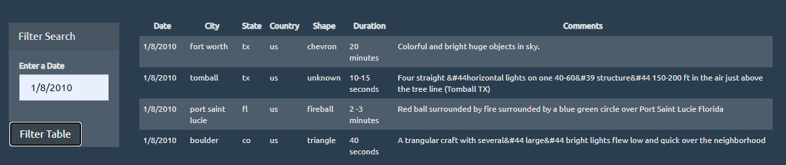

# JavaScript Homework - JavaScript and DOM Manipulation

## Introduction
WAKE UP SHEEPLE! The extra-terrestrial menace has come to Earth and we here at `ALIENS-R-REAL` have collected all of the eye-witness reports we could to prove it! All we need to do now is put this information online for the world to see and then the matter will finally be put to rest.

The objective of this homework is to create a basic HTML web page using the UFO dataset provided in the form of an array of JavaScript objects. We write code that appends a table to our web page and then adds new rows of data for each UFO sighting. We are then able to filter by dates.

## Programs used:
* HTML
* CSS
* JavaScript

## Requirements to run
* Download folder and open in VS Code
* Go live from index html file

making vhanges